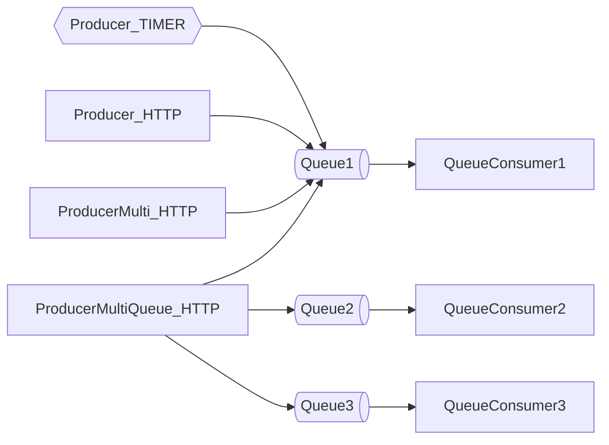
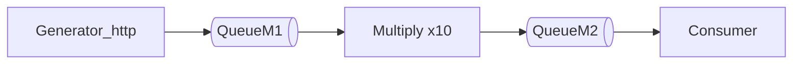


# Notes


## My takeay
 
 ...

## Local Development (settings)

local.settings.json

```json
{
  "IsEncrypted": false,
  "Values": {
    "AzureWebJobsStorage": "UseDevelopmentStorage=true",
    "FUNCTIONS_WORKER_RUNTIME": "dotnet-isolated",
    "KeepMeUpTimer": "0 */3 * * * *"
  }
}
```

## Notes

 - Do not use static methods.

## Queue producers and cusumers



## Queue high load



[. . . . TODO . . . .]

## Mermeid info:

```mermaid
  info
```

## Links

HTTP trigger


Details here:  https://learn.microsoft.com/en-us/azure/azure-functions/dotnet-isolated-process-guide